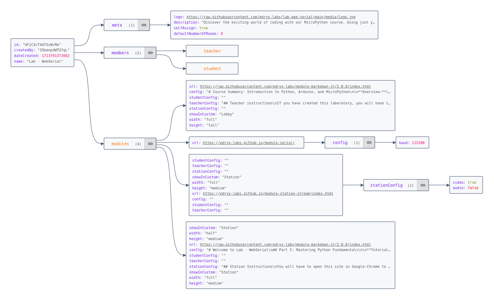
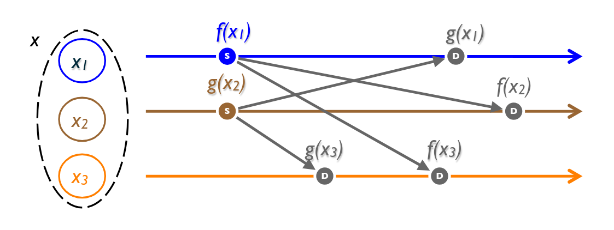

<!--
author:   André Dietrich; Sebastian Zug

email:    andre.dietrich@informatik.tu-bergakademie.de

icon:     img/icon.png
logo:     img/logo.png

version:  0.0.1

language: en

narrator: US English Female

comment:  This presentation introduces **Edrys**, a browser-based remote lab platform designed to enable seamless collaboration in educational and experimental environments. It highlights the core technologies powering Edrys: modular components for flexible lab setups, WebRTC for secure, server-light communication, and CRDTs for consistent state synchronization across users. Attendees will learn how to create and customize virtual classrooms, explore the decentralized nature of the platform, and understand how Edrys's API enables developers to integrate and extend its functionality. By combining accessibility, scalability, and innovation, Edrys transforms the way remote labs and classrooms operate.

-->

# CrossLab and Friends: Edrys-Lite

Open the interactive presentation at:

https://LiaScript.github.io/course/?https://github.com/LiaPlayground/CrossLab-and-Friends/raw/refs/heads/main/README.md

---

<center>

[qr-code](https://LiaScript.github.io/course/?https://github.com/LiaPlayground/CrossLab-and-Friends/raw/refs/heads/main/README.md)

</center>

## Technologies & Concept

    --{{0}}--
The **Edry-Lite** combines three innovative elements to create a simple and effective browser-based learning environment:

Project WebSite: https://edrys-labs.github.io

{{1}} **Flexible Building Blocks**:

    --{{1}}--
The lab uses interchangeable tools like text editors, webcams, and terminals, which can be mixed and matched to suit any lesson or experiment.

{{2}} **Direct Browser Communication**:

    --{{2}}--
By connecting browsers directly, users can collaborate in real time without heavy reliance on servers, making the system lightweight and accessible.

{{3}} **Seamless Collaboration**:

    --{{3}}--
A smart method keeps everyone’s changes in sync, so no matter how or when updates happen, all users stay with the same state.

    --{{4}}--
These technologies work together to create an efficient, decentralized, and user-friendly platform for remote labs and classrooms.

### Modularity & Composability

    --{{0}}--
A **module** is a self-contained, configurable, and reusable component designed for a specific purpose.
Examples include an editor, a terminal, a markdown viewer, a webcam interface, or any other tool you might need.
These modules are designed to be easy to integrate and customize.  
Explore a list of available modules here:  

https://github.com/topics/edrys-module?q=edrys-lite

    --{{1}}--
In this context, a **classroom** or **lab configuration** is simply a collection of pre-configured modules, combined with meta information.
These configurations can be easily shared, adapted, and reused, enabling a seamless collaborative experience.

      {{1}}


    --{{2}}--
Put simply, lab configurations can be treated as **Open Educational Resources (OER)** and **Open Source** projects.
This means they can be freely hosted, shared, and even improved upon.
For example, check out this curated collection of open lab configurations:

https://github.com/topics/edrys-lab

Here’s a refined version of your text, correcting errors, improving readability, and making it accessible to a non-technical audience while retaining technical depth:

### WebRTC - Communication

    --{{0}}--
To connect users within a lab environment, we rely on **WebRTC**, which stands for **Web Real-Time Communication**.
WebRTC allows browsers to communicate directly and securely without requiring a dedicated server.
A server is only needed for the initial connection setup or as a fallback if network configurations are too restrictive.

     {{0-1}}


    --{{1}}--
To establish these connections, we leverage the **WebTorrent network**.
While WebTorrent is commonly known for enabling peer-to-peer file sharing between browsers, we use it solely as a meeting point to initiate communication.
This makes the process lightweight, decentralized, and efficient.

      {{1}}


### CRDTs & State

    --{{0}}--
The final key technology required is used to maintain **state** in a distributed system.
In the absence of a central authority, ensuring consistency between users in a collaborative environment becomes a critical challenge.
This is where **CRDTs** (Conflict-free Replicated Data Types) come into play.
CRDTs allow systems to maintain consistency by enabling operations to be replicated across multiple nodes without conflicts.
In theory, even if updates are made offline or in different orders, CRDTs ensure that all users eventually converge to the same state, thanks to their mathematically proven properties.



[^1]: Marc Shapiro, Nuno Preguiça, Carlos Baquero, Marek Zawirski.  
      A comprehensive study of Convergent and Commutative Replicated Data Types.  
      [Research Report] RR-7506, Inria – Centre Paris-Rocquencourt; INRIA. 2011, pp.50. inria-00555588  
      [Read the full study](https://inria.hal.science/inria-00555588/document)

## Creating Labs

    --{{0}}--
To start, visit the **Edrys Labs** project website and create a new classroom:  

https://edrys-labs.github.io

    --{{1}}--
By doing this, you’ve essentially created a global chatroom with a unique ID and a default configuration.
This initial setup includes a basic reference module you can use to explore and test various features.
As the maintainer, you control this classroom—you can reconfigure it, add modules, and share it as you see fit.

      {{1}}
!?[Screencast edrys](video/edrys-demo.mp4)

### What Really Happens

    --{{0}}--
The entire system, including the lab configuration, user details, chat, and room state, operates as a fully distributed network. All users share the same synchronized state. Every small change—like switching rooms, sending a chat message, updating the configuration, or modifying a module—is communicated to all connected peers in real time.  


    --{{1}}--
To simplify this, the system uses an **operation-based CRDT** (Conflict-free Replicated Data Type) powered by **Yjs**.
When a new peer joins, the current state is transmitted, and afterward, only incremental changes are shared.

      {{1}}
https://yjs.dev

### Developer Happiness - API

    --{{0}}--
Each module in edrys-Lite is embedded securely as an **iframe**, isolating it from the rest of the system to ensure safety and control.
The iframe can interact with the Edrys system using a simple API by importing the following script:

https://edrys-labs.github.io/module/edrys.js

    --{{1}}--
Modules can communicate with each other using just two functions. Messages are restricted to users in the same room:

      {{1}}
```javascript
// Send a message to a specific topic
Edrys.sendMessage("topic", { arbitrary: "data" })

// Listen for incoming messages
Edrys.onMessage(({ from, topic, body }) => {
    console.log("Received message:", topic, body, "from:", from)
})
```

    --{{2}}--
Every room maintains its own lightweight CRDT, ensuring changes are synchronized across all users and modules.
The state can be updated either externally or directly within a module.
Using **Yjs** for state management allows seamless nesting of Yjs-compatible data structures or basic values.

      {{2}}
```javascript
// Access a shared text state
const text = Edrys.getState("name", "Text")
text.insert(0, "Hello World")

// Initialize a shared value with a default
const value = Edrys.getState("somethingElse", "Value", 12)

// Perform multiple state changes in a single transaction
Edrys.updateState(() => {
    // Batch changes here
    ...
})
```

    --{{3}}--
The API also provides functions for managing user roles, accessing configurations, and subscribing to updates. These tools allow developers to create flexible and interactive modules for use in Edrys classrooms.

## Testimonials

> #### RemoteLabs as OER – The next evolutionary step - **U:FF 2024**
>
> !?[YouTube: Presentation](https://www.youtube.com/watch?v=Uv79Y8EhBVw)

---

> #### Expanding the Concept of Open Educational Resources to Remote-Labs - **eLearning Africa 2024**
>
> !?[YouTube: Discovery Demo](https://www.youtube.com/watch?v=Lri9IQBPJLU)

---

> #### Transforming Education: A Journey from Interactive Markdown to Remote-Labs - **WeAreDevelopers 2024**
>
> !?[YouTube: Virtual Presentation](https://www.youtube.com/watch?v=DRz3rMr6OIM)